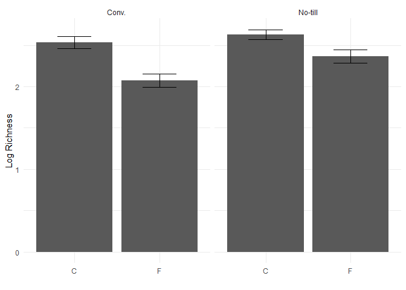

## Seemless data wrangling

The tidyverse is a bunch of packages and functions written by the folks that manages Rstudio.
The tidyverse builds upon base R to allow for easier use of large datasets.h

## Install package tidyverse

install.packages("tidyverse")


``` r
library(tidyverse)
```

```
## ── Attaching core tidyverse packages ──────────────────────── tidyverse 2.0.0 ──
## ✔ dplyr     1.1.4     ✔ readr     2.1.5
## ✔ forcats   1.0.0     ✔ stringr   1.5.1
## ✔ ggplot2   3.5.1     ✔ tibble    3.2.1
## ✔ lubridate 1.9.4     ✔ tidyr     1.3.1
## ✔ purrr     1.0.4     
## ── Conflicts ────────────────────────────────────────── tidyverse_conflicts() ──
## ✖ dplyr::filter() masks stats::filter()
## ✖ dplyr::lag()    masks stats::lag()
## ℹ Use the conflicted package (<http://conflicted.r-lib.org/>) to force all conflicts to become errors
```


``` r
microbiome.fungi <- read.csv("Bull_richness.csv")
str(microbiome.fungi)
```

```
## 'data.frame':	287 obs. of  16 variables:
##  $ SampleID       : chr  "Corn2017LeafObjective2Collection1T1R1CAH2" "Corn2017LeafObjective2Collection1T1R1CBA3" "Corn2017LeafObjective2Collection1T1R1CCB3" "Corn2017LeafObjective2Collection1T1R1FAC3" ...
##  $ Crop           : chr  "Corn" "Corn" "Corn" "Corn" ...
##  $ Objective      : chr  "Objective 2" "Objective 2" "Objective 2" "Objective 2" ...
##  $ Collection     : int  1 1 1 1 1 1 1 1 1 1 ...
##  $ Compartment    : chr  "Leaf" "Leaf" "Leaf" "Leaf" ...
##  $ DateSampled    : chr  "6/26/17" "6/26/17" "6/26/17" "6/26/17" ...
##  $ GrowthStage    : chr  "V6" "V6" "V6" "V6" ...
##  $ Treatment      : chr  "Conv." "Conv." "Conv." "Conv." ...
##  $ Rep            : chr  "R1" "R1" "R1" "R1" ...
##  $ Sample         : chr  "A" "B" "C" "A" ...
##  $ Fungicide      : chr  "C" "C" "C" "F" ...
##  $ Target_organism: chr  "Fungi" "Fungi" "Fungi" "Fungi" ...
##  $ Location       : chr  "Kellogg Biological Station" "Kellogg Biological Station" "Kellogg Biological Station" "Kellogg Biological Station" ...
##  $ Experiment     : chr  "LTER" "LTER" "LTER" "LTER" ...
##  $ Year           : int  2017 2017 2017 2017 2017 2017 2017 2017 2017 2017 ...
##  $ richness       : int  9 6 5 7 4 2 3 8 4 4 ...
```

## select()


``` r
microbiome.fungi2 <- select(microbiome.fungi, SampleID, Crop, Compartment:Fungicide, richness)
```

## filter()


``` r
head(filter(microbiome.fungi2, Treatment == "Conv."))
```

```
##                                    SampleID Crop Compartment DateSampled
## 1 Corn2017LeafObjective2Collection1T1R1CAH2 Corn        Leaf     6/26/17
## 2 Corn2017LeafObjective2Collection1T1R1CBA3 Corn        Leaf     6/26/17
## 3 Corn2017LeafObjective2Collection1T1R1CCB3 Corn        Leaf     6/26/17
## 4 Corn2017LeafObjective2Collection1T1R1FAC3 Corn        Leaf     6/26/17
## 5 Corn2017LeafObjective2Collection1T1R1FBD3 Corn        Leaf     6/26/17
## 6 Corn2017LeafObjective2Collection1T1R1FCE3 Corn        Leaf     6/26/17
##   GrowthStage Treatment Rep Sample Fungicide richness
## 1          V6     Conv.  R1      A         C        9
## 2          V6     Conv.  R1      B         C        6
## 3          V6     Conv.  R1      C         C        5
## 4          V6     Conv.  R1      A         F        7
## 5          V6     Conv.  R1      B         F        4
## 6          V6     Conv.  R1      C         F        2
```

``` r
# A more complex using & 
head(filter(microbiome.fungi2, Treatment == "Conv." & Fungicide == "C"))
```

```
##                                    SampleID Crop Compartment DateSampled
## 1 Corn2017LeafObjective2Collection1T1R1CAH2 Corn        Leaf     6/26/17
## 2 Corn2017LeafObjective2Collection1T1R1CBA3 Corn        Leaf     6/26/17
## 3 Corn2017LeafObjective2Collection1T1R1CCB3 Corn        Leaf     6/26/17
## 4 Corn2017LeafObjective2Collection1T1R2CAF3 Corn        Leaf     6/26/17
## 5 Corn2017LeafObjective2Collection1T1R2CBG3 Corn        Leaf     6/26/17
## 6 Corn2017LeafObjective2Collection1T1R2CCH3 Corn        Leaf     6/26/17
##   GrowthStage Treatment Rep Sample Fungicide richness
## 1          V6     Conv.  R1      A         C        9
## 2          V6     Conv.  R1      B         C        6
## 3          V6     Conv.  R1      C         C        5
## 4          V6     Conv.  R2      A         C        3
## 5          V6     Conv.  R2      B         C        8
## 6          V6     Conv.  R2      C         C        4
```

``` r
# Another more complex using or |
head(filter(microbiome.fungi2, Sample == "A" | Sample == "B")) #Sample A or B
```

```
##                                    SampleID Crop Compartment DateSampled
## 1 Corn2017LeafObjective2Collection1T1R1CAH2 Corn        Leaf     6/26/17
## 2 Corn2017LeafObjective2Collection1T1R1CBA3 Corn        Leaf     6/26/17
## 3 Corn2017LeafObjective2Collection1T1R1FAC3 Corn        Leaf     6/26/17
## 4 Corn2017LeafObjective2Collection1T1R1FBD3 Corn        Leaf     6/26/17
## 5 Corn2017LeafObjective2Collection1T1R2CAF3 Corn        Leaf     6/26/17
## 6 Corn2017LeafObjective2Collection1T1R2CBG3 Corn        Leaf     6/26/17
##   GrowthStage Treatment Rep Sample Fungicide richness
## 1          V6     Conv.  R1      A         C        9
## 2          V6     Conv.  R1      B         C        6
## 3          V6     Conv.  R1      A         F        7
## 4          V6     Conv.  R1      B         F        4
## 5          V6     Conv.  R2      A         C        3
## 6          V6     Conv.  R2      B         C        8
```
## mutate()

It allows us to quickly create new columns


``` r
microbiome.fungi2$logRich <- log(microbiome.fungi2$richness)

# Create a new column called logRich
head(mutate(microbiome.fungi2, logRich = log(richness)))
```

```
##                                    SampleID Crop Compartment DateSampled
## 1 Corn2017LeafObjective2Collection1T1R1CAH2 Corn        Leaf     6/26/17
## 2 Corn2017LeafObjective2Collection1T1R1CBA3 Corn        Leaf     6/26/17
## 3 Corn2017LeafObjective2Collection1T1R1CCB3 Corn        Leaf     6/26/17
## 4 Corn2017LeafObjective2Collection1T1R1FAC3 Corn        Leaf     6/26/17
## 5 Corn2017LeafObjective2Collection1T1R1FBD3 Corn        Leaf     6/26/17
## 6 Corn2017LeafObjective2Collection1T1R1FCE3 Corn        Leaf     6/26/17
##   GrowthStage Treatment Rep Sample Fungicide richness   logRich
## 1          V6     Conv.  R1      A         C        9 2.1972246
## 2          V6     Conv.  R1      B         C        6 1.7917595
## 3          V6     Conv.  R1      C         C        5 1.6094379
## 4          V6     Conv.  R1      A         F        7 1.9459101
## 5          V6     Conv.  R1      B         F        4 1.3862944
## 6          V6     Conv.  R1      C         F        2 0.6931472
```

``` r
# Creating a new column which combines Crop and Treatment
head(mutate(microbiome.fungi2, Crop_Treatment = paste(Crop, Treatment)))
```

```
##                                    SampleID Crop Compartment DateSampled
## 1 Corn2017LeafObjective2Collection1T1R1CAH2 Corn        Leaf     6/26/17
## 2 Corn2017LeafObjective2Collection1T1R1CBA3 Corn        Leaf     6/26/17
## 3 Corn2017LeafObjective2Collection1T1R1CCB3 Corn        Leaf     6/26/17
## 4 Corn2017LeafObjective2Collection1T1R1FAC3 Corn        Leaf     6/26/17
## 5 Corn2017LeafObjective2Collection1T1R1FBD3 Corn        Leaf     6/26/17
## 6 Corn2017LeafObjective2Collection1T1R1FCE3 Corn        Leaf     6/26/17
##   GrowthStage Treatment Rep Sample Fungicide richness   logRich Crop_Treatment
## 1          V6     Conv.  R1      A         C        9 2.1972246     Corn Conv.
## 2          V6     Conv.  R1      B         C        6 1.7917595     Corn Conv.
## 3          V6     Conv.  R1      C         C        5 1.6094379     Corn Conv.
## 4          V6     Conv.  R1      A         F        7 1.9459101     Corn Conv.
## 5          V6     Conv.  R1      B         F        4 1.3862944     Corn Conv.
## 6          V6     Conv.  R1      C         F        2 0.6931472     Corn Conv.
```

### the pipe '%>%'


``` r
library(dplyr)
```


``` r
microbiome.fungi %>%
  select(SampleID, Crop, Compartment:Fungicide, richness) %>%  # selecting columns
  filter(Treatment == "Conv.") %>%  # subsetting to only include the conventional treatments
  mutate(logRich = log(richness)) %>%  # creating new column of the log richness
  head()  # displaying the forst six rows
```

```
##                                    SampleID Crop Compartment DateSampled
## 1 Corn2017LeafObjective2Collection1T1R1CAH2 Corn        Leaf     6/26/17
## 2 Corn2017LeafObjective2Collection1T1R1CBA3 Corn        Leaf     6/26/17
## 3 Corn2017LeafObjective2Collection1T1R1CCB3 Corn        Leaf     6/26/17
## 4 Corn2017LeafObjective2Collection1T1R1FAC3 Corn        Leaf     6/26/17
## 5 Corn2017LeafObjective2Collection1T1R1FBD3 Corn        Leaf     6/26/17
## 6 Corn2017LeafObjective2Collection1T1R1FCE3 Corn        Leaf     6/26/17
##   GrowthStage Treatment Rep Sample Fungicide richness   logRich
## 1          V6     Conv.  R1      A         C        9 2.1972246
## 2          V6     Conv.  R1      B         C        6 1.7917595
## 3          V6     Conv.  R1      C         C        5 1.6094379
## 4          V6     Conv.  R1      A         F        7 1.9459101
## 5          V6     Conv.  R1      B         F        4 1.3862944
## 6          V6     Conv.  R1      C         F        2 0.6931472
```


### 'summerise()'

Use to find the mean, standard deviations/errors


``` r
microbiome.fungi %>%
  select(SampleID, Crop, Compartment:Fungicide, richness) %>%  # selecting columns
  filter(Treatment == "Conv.") %>%  # subsetting to only include the conventional treatments
  mutate(logRich = log(richness)) %>%  # creating new column of the log richness
  summarise(Mean.rich = mean(logRich))  #Calculating overall mean log richness within the conventionally managed treatments 
```

```
##   Mean.rich
## 1  2.304395
```

### 'group_by()'


``` r
microbiome.fungi %>%
  select(SampleID, Crop, Compartment:Fungicide, richness) %>%  # selecting columns
  filter(Treatment == "Conv.") %>%  # subsetting to only include the conventional treatments
  mutate(logRich = log(richness)) %>%  # creating new column of the log richness
  summarise(Mean.rich = mean(logRich),  #Calculating the mean richness, stdeviation, adn standard error
            n = n(),
            sd.dev = sd(logRich)) %>% 
  mutate(std.err = sd.dev/sqrt(n))
```

```
##   Mean.rich   n    sd.dev   std.err
## 1  2.304395 144 0.7024667 0.0585389
```

### Connecting to plotting


``` r
library(ggplot2)
microbiome.fungi %>%
  select(SampleID, Crop, Compartment:Fungicide, richness) %>%  # selecting columns
  group_by(Treatment, Fungicide) %>%  # grouping by treatment and fungicide to later calculate summary stats by group
  mutate(logRich = log(richness)) %>% # creating a new column of the log richness 
  summarise(Mean.rich = mean(logRich), # calculating the mean richness, stdeviation, and standard error 
            n = n(),
            sd.dev = sd(logRich)) %>%
  mutate(std.err = sd.dev/sqrt(n)) %>% 
  ggplot(aes(x = Fungicide, y = Mean.rich)) + # adding in a ggplot 
  geom_bar(stat = "identity") +
  geom_errorbar(aes(x = Fungicide, ymin = Mean.rich - std.err, ymax = Mean.rich + std.err), width = 0.4) + 
  theme_minimal() + 
  xlab("") +
  ylab("Log Richness") +
  facet_wrap(~Treatment)
```

```
## `summarise()` has grouped output by 'Treatment'. You can override using the
## `.groups` argument.
```

<!-- -->

### Joining


``` r
# selecting just the richness and sample id 
richness <- microbiome.fungi %>% 
select(SampleID, richness)  

# selecting the columns that dont include the richness
metadata <- microbiome.fungi %>% 
select(SampleID, Fungicide, Crop, Compartment, GrowthStage, Treatment, Rep, Sample)

head(metadata)
```

```
##                                    SampleID Fungicide Crop Compartment
## 1 Corn2017LeafObjective2Collection1T1R1CAH2         C Corn        Leaf
## 2 Corn2017LeafObjective2Collection1T1R1CBA3         C Corn        Leaf
## 3 Corn2017LeafObjective2Collection1T1R1CCB3         C Corn        Leaf
## 4 Corn2017LeafObjective2Collection1T1R1FAC3         F Corn        Leaf
## 5 Corn2017LeafObjective2Collection1T1R1FBD3         F Corn        Leaf
## 6 Corn2017LeafObjective2Collection1T1R1FCE3         F Corn        Leaf
##   GrowthStage Treatment Rep Sample
## 1          V6     Conv.  R1      A
## 2          V6     Conv.  R1      B
## 3          V6     Conv.  R1      C
## 4          V6     Conv.  R1      A
## 5          V6     Conv.  R1      B
## 6          V6     Conv.  R1      C
```

``` r
head(richness)
```

```
##                                    SampleID richness
## 1 Corn2017LeafObjective2Collection1T1R1CAH2        9
## 2 Corn2017LeafObjective2Collection1T1R1CBA3        6
## 3 Corn2017LeafObjective2Collection1T1R1CCB3        5
## 4 Corn2017LeafObjective2Collection1T1R1FAC3        7
## 5 Corn2017LeafObjective2Collection1T1R1FBD3        4
## 6 Corn2017LeafObjective2Collection1T1R1FCE3        2
```

``` r
head(left_join(metadata, richness, by = "SampleID")) # adding the richness data to the metadata based on the common column of sampleID
```

```
##                                    SampleID Fungicide Crop Compartment
## 1 Corn2017LeafObjective2Collection1T1R1CAH2         C Corn        Leaf
## 2 Corn2017LeafObjective2Collection1T1R1CBA3         C Corn        Leaf
## 3 Corn2017LeafObjective2Collection1T1R1CCB3         C Corn        Leaf
## 4 Corn2017LeafObjective2Collection1T1R1FAC3         F Corn        Leaf
## 5 Corn2017LeafObjective2Collection1T1R1FBD3         F Corn        Leaf
## 6 Corn2017LeafObjective2Collection1T1R1FCE3         F Corn        Leaf
##   GrowthStage Treatment Rep Sample richness
## 1          V6     Conv.  R1      A        9
## 2          V6     Conv.  R1      B        6
## 3          V6     Conv.  R1      C        5
## 4          V6     Conv.  R1      A        7
## 5          V6     Conv.  R1      B        4
## 6          V6     Conv.  R1      C        2
```

### Pivoting
Pivoting is also useful for converting from wide to long format and back again. We can do this with 
'pivot_longer()' and 'pivot_wider()'


``` r
microbiome.fungi %>%
  select(SampleID, Crop, Compartment:Fungicide, richness) %>%
   group_by(Treatment, Fungicide) %>%  # grouping by treatment and fungicide to later calculate summary stats by group
  summarise(Mean = mean(richness))  # Calculate the mean per Treatment and fungicide
```

```
## `summarise()` has grouped output by 'Treatment'. You can override using the
## `.groups` argument.
```

```
## # A tibble: 4 × 3
## # Groups:   Treatment [2]
##   Treatment Fungicide  Mean
##   <chr>     <chr>     <dbl>
## 1 Conv.     C         14.6 
## 2 Conv.     F          9.75
## 3 No-till   C         15.4 
## 4 No-till   F         13.1
```
# Wide format -dets the values within the fungicide column into column names


``` r
microbiome.fungi %>%
  select(SampleID, Crop, Compartment:Fungicide, richness) %>%
   group_by(Treatment, Fungicide) %>%  # grouping by treatment and fungicide to later calculate summary stats by group
  summarise(Mean = mean(richness)) %>%  # Calculate the mean per Treatment and fungicide
  pivot_wider(names_from = Fungicide, values_from = Mean) # pivot to wide format
```

```
## `summarise()` has grouped output by 'Treatment'. You can override using the
## `.groups` argument.
```

```
## # A tibble: 2 × 3
## # Groups:   Treatment [2]
##   Treatment     C     F
##   <chr>     <dbl> <dbl>
## 1 Conv.      14.6  9.75
## 2 No-till    15.4 13.1
```


``` r
microbiome.fungi %>%
  select(SampleID, Crop, Compartment:Fungicide, richness) %>%
   group_by(Treatment, Fungicide) %>%  # grouping by treatment and fungicide to later calculate summary stats by group
  summarise(Mean = mean(richness)) %>%  # Calculate the mean per Treatment and fungicide
  pivot_wider(names_from = Fungicide, values_from = Mean) %>% # pivot to wide format
  mutate(diff.fungicide = C - F) # calculate the difference between means
```

```
## `summarise()` has grouped output by 'Treatment'. You can override using the
## `.groups` argument.
```

```
## # A tibble: 2 × 4
## # Groups:   Treatment [2]
##   Treatment     C     F diff.fungicide
##   <chr>     <dbl> <dbl>          <dbl>
## 1 Conv.      14.6  9.75           4.89
## 2 No-till    15.4 13.1            2.32
```


``` r
microbiome.fungi %>%
  select(SampleID, Crop, Compartment:Fungicide, richness) %>% # selecting columns  
  group_by(Treatment, Fungicide) %>% # grouping by treatment and fungicide to later calculate summary stats by group
  summarise(Mean = mean(richness)) %>% # calculates the mean per Treatment and Fungicide 
  pivot_wider(names_from = Fungicide, values_from = Mean) %>% # pivot to wide format
  mutate(diff.fungicide = C - F) %>%  # calculate the difference between the means. 
  ggplot(aes(x = Treatment, y = diff.fungicide)) + # Plot it 
  geom_col() +
  theme_minimal() +
  xlab("") +
  ylab("Difference in average species richness")
```

```
## `summarise()` has grouped output by 'Treatment'. You can override using the
## `.groups` argument.
```

<!-- -->


