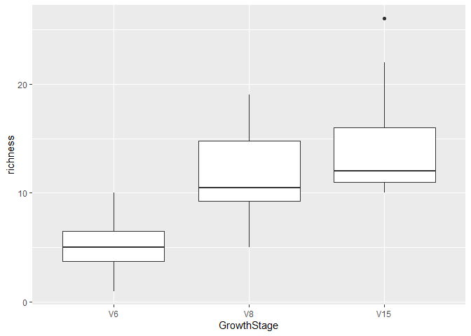

``` r
library(tidyverse)
```

    ## ── Attaching core tidyverse packages ──────────────────────── tidyverse 2.0.0 ──
    ## ✔ dplyr     1.1.4     ✔ readr     2.1.5
    ## ✔ forcats   1.0.0     ✔ stringr   1.5.1
    ## ✔ ggplot2   3.5.1     ✔ tibble    3.2.1
    ## ✔ lubridate 1.9.4     ✔ tidyr     1.3.1
    ## ✔ purrr     1.0.4     
    ## ── Conflicts ────────────────────────────────────────── tidyverse_conflicts() ──
    ## ✖ dplyr::filter() masks stats::filter()
    ## ✖ dplyr::lag()    masks stats::lag()
    ## ℹ Use the conflicted package (<http://conflicted.r-lib.org/>) to force all conflicts to become errors

``` r
library(lme4)
```

    ## Loading required package: Matrix
    ## 
    ## Attaching package: 'Matrix'
    ## 
    ## The following objects are masked from 'package:tidyr':
    ## 
    ##     expand, pack, unpack

``` r
library(emmeans)
```

    ## Welcome to emmeans.
    ## Caution: You lose important information if you filter this package's results.
    ## See '? untidy'

``` r
library(multcomp)
```

    ## Loading required package: mvtnorm
    ## Loading required package: survival
    ## Loading required package: TH.data
    ## Loading required package: MASS
    ## 
    ## Attaching package: 'MASS'
    ## 
    ## The following object is masked from 'package:dplyr':
    ## 
    ##     select
    ## 
    ## 
    ## Attaching package: 'TH.data'
    ## 
    ## The following object is masked from 'package:MASS':
    ## 
    ##     geyser

``` r
data("mtcars")
```

``` r
ggplot(mtcars, aes(x = wt, y = mpg)) +
  geom_smooth(method = lm, se = FALSE, color = "grey") +
  geom_point(aes(color = wt)) +
  xlab("Weight") + 
  ylab("Miles per gallon") +
  scale_colour_gradient(low = "forestgreen", high = "black") +
  theme_classic()
```

    ## `geom_smooth()` using formula = 'y ~ x'

<!-- -->

``` r
lm1 <- lm(mpg ~ wt, data = mtcars)
summary(lm1)
```

    ## 
    ## Call:
    ## lm(formula = mpg ~ wt, data = mtcars)
    ## 
    ## Residuals:
    ##     Min      1Q  Median      3Q     Max 
    ## -4.5432 -2.3647 -0.1252  1.4096  6.8727 
    ## 
    ## Coefficients:
    ##             Estimate Std. Error t value Pr(>|t|)    
    ## (Intercept)  37.2851     1.8776  19.858  < 2e-16 ***
    ## wt           -5.3445     0.5591  -9.559 1.29e-10 ***
    ## ---
    ## Signif. codes:  0 '***' 0.001 '**' 0.01 '*' 0.05 '.' 0.1 ' ' 1
    ## 
    ## Residual standard error: 3.046 on 30 degrees of freedom
    ## Multiple R-squared:  0.7528, Adjusted R-squared:  0.7446 
    ## F-statistic: 91.38 on 1 and 30 DF,  p-value: 1.294e-10

``` r
anova(lm1)
```

    ## Analysis of Variance Table
    ## 
    ## Response: mpg
    ##           Df Sum Sq Mean Sq F value    Pr(>F)    
    ## wt         1 847.73  847.73  91.375 1.294e-10 ***
    ## Residuals 30 278.32    9.28                      
    ## ---
    ## Signif. codes:  0 '***' 0.001 '**' 0.01 '*' 0.05 '.' 0.1 ' ' 1

``` r
cor.test(mtcars$wt, mtcars$mpg)
```

    ## 
    ##  Pearson's product-moment correlation
    ## 
    ## data:  mtcars$wt and mtcars$mpg
    ## t = -9.559, df = 30, p-value = 1.294e-10
    ## alternative hypothesis: true correlation is not equal to 0
    ## 95 percent confidence interval:
    ##  -0.9338264 -0.7440872
    ## sample estimates:
    ##        cor 
    ## -0.8676594

``` r
model <- lm(mpg~wt, data = mtcars)

ggplot(model, aes(y = .resid, x = .fitted)) +
  geom_point() +
  geom_hline(yintercept = 0)
```

<!-- -->

``` r
bull.rich <- read.csv("Bull_richness.csv")

str(bull.rich)
```

    ## 'data.frame':    287 obs. of  16 variables:
    ##  $ SampleID       : chr  "Corn2017LeafObjective2Collection1T1R1CAH2" "Corn2017LeafObjective2Collection1T1R1CBA3" "Corn2017LeafObjective2Collection1T1R1CCB3" "Corn2017LeafObjective2Collection1T1R1FAC3" ...
    ##  $ Crop           : chr  "Corn" "Corn" "Corn" "Corn" ...
    ##  $ Objective      : chr  "Objective 2" "Objective 2" "Objective 2" "Objective 2" ...
    ##  $ Collection     : int  1 1 1 1 1 1 1 1 1 1 ...
    ##  $ Compartment    : chr  "Leaf" "Leaf" "Leaf" "Leaf" ...
    ##  $ DateSampled    : chr  "6/26/17" "6/26/17" "6/26/17" "6/26/17" ...
    ##  $ GrowthStage    : chr  "V6" "V6" "V6" "V6" ...
    ##  $ Treatment      : chr  "Conv." "Conv." "Conv." "Conv." ...
    ##  $ Rep            : chr  "R1" "R1" "R1" "R1" ...
    ##  $ Sample         : chr  "A" "B" "C" "A" ...
    ##  $ Fungicide      : chr  "C" "C" "C" "F" ...
    ##  $ Target_organism: chr  "Fungi" "Fungi" "Fungi" "Fungi" ...
    ##  $ Location       : chr  "Kellogg Biological Station" "Kellogg Biological Station" "Kellogg Biological Station" "Kellogg Biological Station" ...
    ##  $ Experiment     : chr  "LTER" "LTER" "LTER" "LTER" ...
    ##  $ Year           : int  2017 2017 2017 2017 2017 2017 2017 2017 2017 2017 ...
    ##  $ richness       : int  9 6 5 7 4 2 3 8 4 4 ...

``` r
head(bull.rich)
```

    ##                                    SampleID Crop   Objective Collection
    ## 1 Corn2017LeafObjective2Collection1T1R1CAH2 Corn Objective 2          1
    ## 2 Corn2017LeafObjective2Collection1T1R1CBA3 Corn Objective 2          1
    ## 3 Corn2017LeafObjective2Collection1T1R1CCB3 Corn Objective 2          1
    ## 4 Corn2017LeafObjective2Collection1T1R1FAC3 Corn Objective 2          1
    ## 5 Corn2017LeafObjective2Collection1T1R1FBD3 Corn Objective 2          1
    ## 6 Corn2017LeafObjective2Collection1T1R1FCE3 Corn Objective 2          1
    ##   Compartment DateSampled GrowthStage Treatment Rep Sample Fungicide
    ## 1        Leaf     6/26/17          V6     Conv.  R1      A         C
    ## 2        Leaf     6/26/17          V6     Conv.  R1      B         C
    ## 3        Leaf     6/26/17          V6     Conv.  R1      C         C
    ## 4        Leaf     6/26/17          V6     Conv.  R1      A         F
    ## 5        Leaf     6/26/17          V6     Conv.  R1      B         F
    ## 6        Leaf     6/26/17          V6     Conv.  R1      C         F
    ##   Target_organism                   Location Experiment Year richness
    ## 1           Fungi Kellogg Biological Station       LTER 2017        9
    ## 2           Fungi Kellogg Biological Station       LTER 2017        6
    ## 3           Fungi Kellogg Biological Station       LTER 2017        5
    ## 4           Fungi Kellogg Biological Station       LTER 2017        7
    ## 5           Fungi Kellogg Biological Station       LTER 2017        4
    ## 6           Fungi Kellogg Biological Station       LTER 2017        2

``` r
library(tidyverse)
bull.rich.sub <- bull.rich %>%
  filter(GrowthStage == "V8" & Treatment == "Conv.")

t.test(richness ~ Fungicide, data = bull.rich.sub)
```

    ## 
    ##  Welch Two Sample t-test
    ## 
    ## data:  richness by Fungicide
    ## t = 4.8759, df = 17.166, p-value = 0.0001384
    ## alternative hypothesis: true difference in means between group C and group F is not equal to 0
    ## 95 percent confidence interval:
    ##   4.067909 10.265425
    ## sample estimates:
    ## mean in group C mean in group F 
    ##       11.750000        4.583333

``` r
summary(lm(richness~Fungicide, data = bull.rich.sub))
```

    ## 
    ## Call:
    ## lm(formula = richness ~ Fungicide, data = bull.rich.sub)
    ## 
    ## Residuals:
    ##     Min      1Q  Median      3Q     Max 
    ## -6.7500 -1.7500 -0.6667  2.2500  7.2500 
    ## 
    ## Coefficients:
    ##             Estimate Std. Error t value Pr(>|t|)    
    ## (Intercept)   11.750      1.039  11.306 1.24e-10 ***
    ## FungicideF    -7.167      1.470  -4.876 7.12e-05 ***
    ## ---
    ## Signif. codes:  0 '***' 0.001 '**' 0.01 '*' 0.05 '.' 0.1 ' ' 1
    ## 
    ## Residual standard error: 3.6 on 22 degrees of freedom
    ## Multiple R-squared:  0.5194, Adjusted R-squared:  0.4975 
    ## F-statistic: 23.77 on 1 and 22 DF,  p-value: 7.118e-05

``` r
anova(lm(richness~Fungicide, data = bull.rich.sub))
```

    ## Analysis of Variance Table
    ## 
    ## Response: richness
    ##           Df Sum Sq Mean Sq F value    Pr(>F)    
    ## Fungicide  1 308.17 308.167  23.774 7.118e-05 ***
    ## Residuals 22 285.17  12.962                      
    ## ---
    ## Signif. codes:  0 '***' 0.001 '**' 0.01 '*' 0.05 '.' 0.1 ' ' 1

``` r
bull.rich.sub2 <- bull.rich %>%
  filter(Fungicide == "C" & Treatment == "Conv." & Crop == "Corn")
```

``` r
bull.rich.sub2$GrowthStage <- factor(bull.rich.sub2$GrowthStage, levels = c("V6", "V8", "V15"))

ggplot(bull.rich.sub2, aes(x = GrowthStage, y = richness)) +
  geom_boxplot()
```

<!-- -->

``` r
lm3 <- lm(richness ~ GrowthStage, data = bull.rich.sub2)
summary(lm3)
```

    ## 
    ## Call:
    ## lm(formula = richness ~ GrowthStage, data = bull.rich.sub2)
    ## 
    ## Residuals:
    ##    Min     1Q Median     3Q    Max 
    ## -6.750 -2.625 -1.000  2.250 11.583 
    ## 
    ## Coefficients:
    ##                Estimate Std. Error t value Pr(>|t|)    
    ## (Intercept)       5.250      1.208   4.348 0.000124 ***
    ## GrowthStageV8     6.500      1.708   3.806 0.000581 ***
    ## GrowthStageV15    9.167      1.708   5.368 6.23e-06 ***
    ## ---
    ## Signif. codes:  0 '***' 0.001 '**' 0.01 '*' 0.05 '.' 0.1 ' ' 1
    ## 
    ## Residual standard error: 4.183 on 33 degrees of freedom
    ## Multiple R-squared:  0.4803, Adjusted R-squared:  0.4488 
    ## F-statistic: 15.25 on 2 and 33 DF,  p-value: 2.044e-05

``` r
anova(lm3)
```

    ## Analysis of Variance Table
    ## 
    ## Response: richness
    ##             Df Sum Sq Mean Sq F value    Pr(>F)    
    ## GrowthStage  2 533.56 266.778  15.247 2.044e-05 ***
    ## Residuals   33 577.42  17.497                      
    ## ---
    ## Signif. codes:  0 '***' 0.001 '**' 0.01 '*' 0.05 '.' 0.1 ' ' 1

``` r
summary(aov(richness ~ GrowthStage, data = bull.rich.sub2))
```

    ##             Df Sum Sq Mean Sq F value   Pr(>F)    
    ## GrowthStage  2  533.6   266.8   15.25 2.04e-05 ***
    ## Residuals   33  577.4    17.5                     
    ## ---
    ## Signif. codes:  0 '***' 0.001 '**' 0.01 '*' 0.05 '.' 0.1 ' ' 1

``` r
library(emmeans)
library(multcomp)
library(dplyr)
sessionInfo()
```

    ## R version 4.4.3 (2025-02-28 ucrt)
    ## Platform: x86_64-w64-mingw32/x64
    ## Running under: Windows 11 x64 (build 26100)
    ## 
    ## Matrix products: default
    ## 
    ## 
    ## locale:
    ## [1] LC_COLLATE=English_India.utf8  LC_CTYPE=English_India.utf8   
    ## [3] LC_MONETARY=English_India.utf8 LC_NUMERIC=C                  
    ## [5] LC_TIME=English_India.utf8    
    ## 
    ## time zone: America/Chicago
    ## tzcode source: internal
    ## 
    ## attached base packages:
    ## [1] stats     graphics  grDevices utils     datasets  methods   base     
    ## 
    ## other attached packages:
    ##  [1] multcomp_1.4-28 TH.data_1.1-3   MASS_7.3-64     survival_3.8-3 
    ##  [5] mvtnorm_1.3-3   emmeans_1.11.0  lme4_1.1-37     Matrix_1.7-2   
    ##  [9] lubridate_1.9.4 forcats_1.0.0   stringr_1.5.1   dplyr_1.1.4    
    ## [13] purrr_1.0.4     readr_2.1.5     tidyr_1.3.1     tibble_3.2.1   
    ## [17] ggplot2_3.5.1   tidyverse_2.0.0
    ## 
    ## loaded via a namespace (and not attached):
    ##  [1] sandwich_3.1-1     generics_0.1.3     stringi_1.8.4      lattice_0.22-6    
    ##  [5] hms_1.1.3          digest_0.6.37      magrittr_2.0.3     estimability_1.5.1
    ##  [9] evaluate_1.0.3     grid_4.4.3         timechange_0.3.0   fastmap_1.2.0     
    ## [13] mgcv_1.9-1         scales_1.3.0       codetools_0.2-20   reformulas_0.4.0  
    ## [17] Rdpack_2.6.3       cli_3.6.4          rlang_1.1.5        rbibutils_2.3     
    ## [21] munsell_0.5.1      splines_4.4.3      withr_3.0.2        yaml_2.3.10       
    ## [25] tools_4.4.3        tzdb_0.5.0         nloptr_2.2.1       minqa_1.2.8       
    ## [29] colorspace_2.1-1   boot_1.3-31        vctrs_0.6.5        R6_2.6.1          
    ## [33] zoo_1.8-13         lifecycle_1.0.4    pkgconfig_2.0.3    pillar_1.10.1     
    ## [37] gtable_0.3.6       glue_1.8.0         Rcpp_1.0.14        xfun_0.51         
    ## [41] tidyselect_1.2.1   rstudioapi_0.17.1  knitr_1.50         farver_2.1.2      
    ## [45] xtable_1.8-4       htmltools_0.5.8.1  nlme_3.1-167       labeling_0.4.3    
    ## [49] rmarkdown_2.29     compiler_4.4.3

``` r
lsmeans <- emmeans(lm3, ~GrowthStage) # estimate lsmeans of variety within siteXyear
Results_lsmeans <- cld(lsmeans, alpha = 0.05, reversed = TRUE, details = TRUE) # contrast with Tukey ajustment by default. 
Results_lsmeans
```

    ## $emmeans
    ##  GrowthStage emmean   SE df lower.CL upper.CL .group
    ##  V15          14.42 1.21 33    11.96    16.87  1    
    ##  V8           11.75 1.21 33     9.29    14.21  1    
    ##  V6            5.25 1.21 33     2.79     7.71   2   
    ## 
    ## Confidence level used: 0.95 
    ## P value adjustment: tukey method for comparing a family of 3 estimates 
    ## significance level used: alpha = 0.05 
    ## NOTE: If two or more means share the same grouping symbol,
    ##       then we cannot show them to be different.
    ##       But we also did not show them to be the same. 
    ## 
    ## $comparisons
    ##  contrast estimate   SE df t.ratio p.value
    ##  V8 - V6      6.50 1.71 33   3.806  0.0016
    ##  V15 - V6     9.17 1.71 33   5.368  <.0001
    ##  V15 - V8     2.67 1.71 33   1.562  0.2763
    ## 
    ## P value adjustment: tukey method for comparing a family of 3 estimates

``` r
bull.rich.sub3 <- bull.rich %>% 
  filter(Treatment == "Conv." & Crop == "Corn")

bull.rich.sub3$GrowthStage <- factor(bull.rich.sub3$GrowthStage, levels = c("V6", "V8", "V15"))
```

``` r
lm.inter <- lm(richness ~ GrowthStage*Fungicide, data = bull.rich.sub3)
```

``` r
summary(lm.inter) # significant terms
```

    ## 
    ## Call:
    ## lm(formula = richness ~ GrowthStage * Fungicide, data = bull.rich.sub3)
    ## 
    ## Residuals:
    ##     Min      1Q  Median      3Q     Max 
    ## -8.5000 -2.4167 -0.4167  2.0625 11.5833 
    ## 
    ## Coefficients:
    ##                           Estimate Std. Error t value Pr(>|t|)    
    ## (Intercept)                 5.2500     1.1029   4.760 1.10e-05 ***
    ## GrowthStageV8               6.5000     1.5597   4.167 9.15e-05 ***
    ## GrowthStageV15              9.1667     1.5597   5.877 1.51e-07 ***
    ## FungicideF                 -1.2500     1.5597  -0.801  0.42575    
    ## GrowthStageV8:FungicideF   -5.9167     2.2057  -2.682  0.00923 ** 
    ## GrowthStageV15:FungicideF   0.3333     2.2057   0.151  0.88034    
    ## ---
    ## Signif. codes:  0 '***' 0.001 '**' 0.01 '*' 0.05 '.' 0.1 ' ' 1
    ## 
    ## Residual standard error: 3.82 on 66 degrees of freedom
    ## Multiple R-squared:  0.5903, Adjusted R-squared:  0.5593 
    ## F-statistic: 19.02 on 5 and 66 DF,  p-value: 1.144e-11

``` r
anova(lm.inter) # The interaction term is signifant. 
```

    ## Analysis of Variance Table
    ## 
    ## Response: richness
    ##                       Df  Sum Sq Mean Sq F value    Pr(>F)    
    ## GrowthStage            2 1065.58  532.79 36.5027 2.113e-11 ***
    ## Fungicide              1  174.22  174.22 11.9363 0.0009668 ***
    ## GrowthStage:Fungicide  2  148.36   74.18  5.0823 0.0088534 ** 
    ## Residuals             66  963.33   14.60                      
    ## ---
    ## Signif. codes:  0 '***' 0.001 '**' 0.01 '*' 0.05 '.' 0.1 ' ' 1

``` r
lsmeans <- emmeans(lm.inter, ~Fungicide|GrowthStage) # estimate lsmeans of variety within siteXyear
Results_lsmeans <- cld(lsmeans, alpha = 0.05, reversed = TRUE, details = TRUE) # contrast with Tukey ajustment
Results_lsmeans
```

    ## $emmeans
    ## GrowthStage = V6:
    ##  Fungicide emmean  SE df lower.CL upper.CL .group
    ##  C           5.25 1.1 66     3.05     7.45  1    
    ##  F           4.00 1.1 66     1.80     6.20  1    
    ## 
    ## GrowthStage = V8:
    ##  Fungicide emmean  SE df lower.CL upper.CL .group
    ##  C          11.75 1.1 66     9.55    13.95  1    
    ##  F           4.58 1.1 66     2.38     6.79   2   
    ## 
    ## GrowthStage = V15:
    ##  Fungicide emmean  SE df lower.CL upper.CL .group
    ##  C          14.42 1.1 66    12.21    16.62  1    
    ##  F          13.50 1.1 66    11.30    15.70  1    
    ## 
    ## Confidence level used: 0.95 
    ## significance level used: alpha = 0.05 
    ## NOTE: If two or more means share the same grouping symbol,
    ##       then we cannot show them to be different.
    ##       But we also did not show them to be the same. 
    ## 
    ## $comparisons
    ## GrowthStage = V6:
    ##  contrast estimate   SE df t.ratio p.value
    ##  C - F       1.250 1.56 66   0.801  0.4258
    ## 
    ## GrowthStage = V8:
    ##  contrast estimate   SE df t.ratio p.value
    ##  C - F       7.167 1.56 66   4.595  <.0001
    ## 
    ## GrowthStage = V15:
    ##  contrast estimate   SE df t.ratio p.value
    ##  C - F       0.917 1.56 66   0.588  0.5587

``` r
library(ggplot2)

bull.rich.sub3 %>%
  ggplot(aes(x = GrowthStage, y = richness, color = Fungicide)) +
  geom_boxplot()
```

<!-- -->

# Mixed effects models

``` r
library(lme4)
```

``` r
lm.inter2 <- lmer(richness ~ GrowthStage*Fungicide + (1|Rep), data = bull.rich.sub3)
summary(lm.inter2) # significant terms
```

    ## Linear mixed model fit by REML ['lmerMod']
    ## Formula: richness ~ GrowthStage * Fungicide + (1 | Rep)
    ##    Data: bull.rich.sub3
    ## 
    ## REML criterion at convergence: 378.3
    ## 
    ## Scaled residuals: 
    ##     Min      1Q  Median      3Q     Max 
    ## -2.4664 -0.5966 -0.1788  0.6257  2.9101 
    ## 
    ## Random effects:
    ##  Groups   Name        Variance Std.Dev.
    ##  Rep      (Intercept)  0.7855  0.8863  
    ##  Residual             13.9533  3.7354  
    ## Number of obs: 72, groups:  Rep, 4
    ## 
    ## Fixed effects:
    ##                           Estimate Std. Error t value
    ## (Intercept)                 5.2500     1.1658   4.503
    ## GrowthStageV8               6.5000     1.5250   4.262
    ## GrowthStageV15              9.1667     1.5250   6.011
    ## FungicideF                 -1.2500     1.5250  -0.820
    ## GrowthStageV8:FungicideF   -5.9167     2.1566  -2.743
    ## GrowthStageV15:FungicideF   0.3333     2.1566   0.155
    ## 
    ## Correlation of Fixed Effects:
    ##             (Intr) GrwSV8 GrSV15 FngcdF GSV8:F
    ## GrowthStgV8 -0.654                            
    ## GrwthStgV15 -0.654  0.500                     
    ## FungicideF  -0.654  0.500  0.500              
    ## GrwthSV8:FF  0.462 -0.707 -0.354 -0.707       
    ## GrwtSV15:FF  0.462 -0.354 -0.707 -0.707  0.500

``` r
summary(lm.inter)
```

    ## 
    ## Call:
    ## lm(formula = richness ~ GrowthStage * Fungicide, data = bull.rich.sub3)
    ## 
    ## Residuals:
    ##     Min      1Q  Median      3Q     Max 
    ## -8.5000 -2.4167 -0.4167  2.0625 11.5833 
    ## 
    ## Coefficients:
    ##                           Estimate Std. Error t value Pr(>|t|)    
    ## (Intercept)                 5.2500     1.1029   4.760 1.10e-05 ***
    ## GrowthStageV8               6.5000     1.5597   4.167 9.15e-05 ***
    ## GrowthStageV15              9.1667     1.5597   5.877 1.51e-07 ***
    ## FungicideF                 -1.2500     1.5597  -0.801  0.42575    
    ## GrowthStageV8:FungicideF   -5.9167     2.2057  -2.682  0.00923 ** 
    ## GrowthStageV15:FungicideF   0.3333     2.2057   0.151  0.88034    
    ## ---
    ## Signif. codes:  0 '***' 0.001 '**' 0.01 '*' 0.05 '.' 0.1 ' ' 1
    ## 
    ## Residual standard error: 3.82 on 66 degrees of freedom
    ## Multiple R-squared:  0.5903, Adjusted R-squared:  0.5593 
    ## F-statistic: 19.02 on 5 and 66 DF,  p-value: 1.144e-11

``` r
lsmeans <- emmeans(lm.inter2, ~Fungicide|GrowthStage) # estimate lsmeans of variety within siteXyear
Results_lsmeans <- cld(lsmeans, alpha = 0.05, details = TRUE) # contrast with Tukey ajustment
Results_lsmeans
```

    ## $emmeans
    ## GrowthStage = V6:
    ##  Fungicide emmean   SE   df lower.CL upper.CL .group
    ##  F           4.00 1.17 28.1     1.61     6.39  1    
    ##  C           5.25 1.17 28.1     2.86     7.64  1    
    ## 
    ## GrowthStage = V8:
    ##  Fungicide emmean   SE   df lower.CL upper.CL .group
    ##  F           4.58 1.17 28.1     2.20     6.97  1    
    ##  C          11.75 1.17 28.1     9.36    14.14   2   
    ## 
    ## GrowthStage = V15:
    ##  Fungicide emmean   SE   df lower.CL upper.CL .group
    ##  F          13.50 1.17 28.1    11.11    15.89  1    
    ##  C          14.42 1.17 28.1    12.03    16.80  1    
    ## 
    ## Degrees-of-freedom method: kenward-roger 
    ## Confidence level used: 0.95 
    ## significance level used: alpha = 0.05 
    ## NOTE: If two or more means share the same grouping symbol,
    ##       then we cannot show them to be different.
    ##       But we also did not show them to be the same. 
    ## 
    ## $comparisons
    ## GrowthStage = V6:
    ##  contrast estimate   SE df t.ratio p.value
    ##  C - F       1.250 1.52 63   0.820  0.4155
    ## 
    ## GrowthStage = V8:
    ##  contrast estimate   SE df t.ratio p.value
    ##  C - F       7.167 1.52 63   4.700  <.0001
    ## 
    ## GrowthStage = V15:
    ##  contrast estimate   SE df t.ratio p.value
    ##  C - F       0.917 1.52 63   0.601  0.5499
    ## 
    ## Degrees-of-freedom method: kenward-roger
