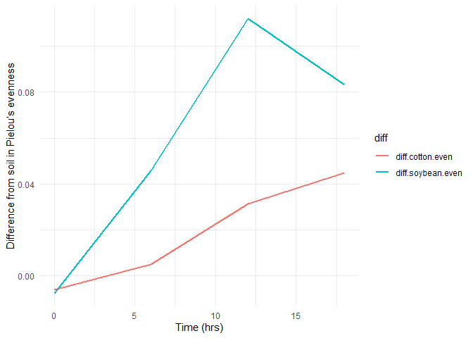

    library(tidyverse)

    ## ── Attaching core tidyverse packages ──────────────────────── tidyverse 2.0.0 ──
    ## ✔ dplyr     1.1.4     ✔ readr     2.1.5
    ## ✔ forcats   1.0.0     ✔ stringr   1.5.1
    ## ✔ ggplot2   3.5.1     ✔ tibble    3.2.1
    ## ✔ lubridate 1.9.4     ✔ tidyr     1.3.1
    ## ✔ purrr     1.0.4     
    ## ── Conflicts ────────────────────────────────────────── tidyverse_conflicts() ──
    ## ✖ dplyr::filter() masks stats::filter()
    ## ✖ dplyr::lag()    masks stats::lag()
    ## ℹ Use the conflicted package (<http://conflicted.r-lib.org/>) to force all conflicts to become errors

    ### Q2

    # load csv file

    diversity_data <- read.csv("DiversityData.csv")

    meta_data <- read.csv("Metadata.csv")

    # join the dataframe by the common column

    alpha <- left_join(diversity_data, meta_data, by = "Code")

    ### Q3

    # a)

    library(dplyr)

    # calculating Pielou's evenness index

    alpha$Pielou_evenness <- log(alpha$richness)

    # Create a new column called Pielou_evenness and name the dataframe as alpha_even
    alpha_even <- alpha %>%
                  mutate(Pielou_evenness = shannon / log(richness))

### Q4

    # summarizing Pielou's evenness by Crop and Time_Point and Summarize the data

    alpha_average <- alpha_even %>%
                      group_by(Crop, Time_Point) %>%
                      summarise(mean_even = mean(Pielou_evenness),
                      count_even = n(),
                      sd.dev = sd(Pielou_evenness),
                      sd.err = sd(Pielou_evenness)/sqrt(n()))

    ## `summarise()` has grouped output by 'Crop'. You can override using the
    ## `.groups` argument.

### Q5

# Calculate the difference between the soybean column, the soil column, and the difference between the cotton column and the soil column

    alpha_average2 <- alpha_average %>%
                      select(Time_Point, Crop, mean_even) %>%
                      pivot_wider(names_from = Crop, values_from = mean_even) %>%
                      mutate(diff.cotton.even = Soil - Cotton,
                             diff.soybean.even = Soil - Soybean)

### Q6

# Connecting it to plots

    alpha_average2 %>%
      select(Time_Point, diff.cotton.even, diff.soybean.even) %>%  # Select relevant columns
      pivot_longer(cols = c(diff.cotton.even, diff.soybean.even), names_to = "diff") %>%
      ggplot(aes(x = Time_Point, y = value, color = diff)) +
      geom_line(size = 1) +  # Line plot
      theme_minimal() +  # Clean theme
      labs(
        x = "Time (hrs)",
        y = "Difference from soil in Pielou’s evenness",
        color = "diff"
      ) + 
      theme(legend.position = "right")

    ## Warning: Using `size` aesthetic for lines was deprecated in ggplot2 3.4.0.
    ## ℹ Please use `linewidth` instead.
    ## This warning is displayed once every 8 hours.
    ## Call `lifecycle::last_lifecycle_warnings()` to see where this warning was
    ## generated.

