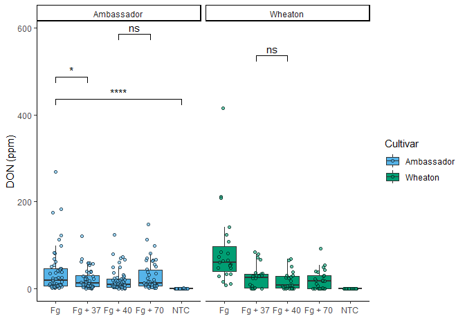

- [Link of manuscript](https://doi.org/10.1094/PDIS-06-21-1253-RE)

## File Tree

``` r
library("fs")
fs::dir_tree(path = "D:/Spring 2025/PLPA7820/Class-Reports/Assignments/Coding Challnge 4")
```

    ## D:/Spring 2025/PLPA7820/Class-Reports/Assignments/Coding Challnge 4
    ## ├── R Markdown Coding Challenge.Rmd
    ## ├── R-Markdown-Coding-Challenge.docx
    ## ├── R-Markdown-Coding-Challenge.html
    ## └── R-Markdown-Coding-Challenge.pdf

## Q1

# YAML Header:

YAML header is a short blob of text, specially formatted with key: value
pairs tags, that seats at the top of our Rmarkdown document. It contains
YAML arguments such as “Title”, “Author”, and “Output”, demarcated by
three dashes (—) on either end.

# Literate Programming:

A methodology that combines a programming language with a documentation
language, thereby making programs more robust, more portable, more
easily maintained, and arguably more fun to write than programs that are
written only in a high-level language.

## Q2

``` r
# Load dataset of MycotoxinData
Mycotoxin_Data <- read.csv("D:/Spring 2025/PLPA7820/Class-Reports/MycotoxinData.csv", na.strings = "na")
```

``` r
# structure of the dataframe
str(Mycotoxin_Data)
```

    ## 'data.frame':    375 obs. of  6 variables:
    ##  $ Treatment     : chr  "Fg" "Fg" "Fg" "Fg" ...
    ##  $ Cultivar      : chr  "Wheaton" "Wheaton" "Wheaton" "Wheaton" ...
    ##  $ BioRep        : int  2 2 2 2 2 2 2 2 2 3 ...
    ##  $ MassperSeed_mg: num  10.29 12.8 2.85 6.5 10.18 ...
    ##  $ DON           : num  107.3 32.6 416 211.9 124 ...
    ##  $ X15ADON       : num  3 0.85 3.5 3.1 4.8 3.3 6.9 2.9 2.1 0.71 ...

``` r
# plotting data using ggplota2 (Boxplot)

library(ggplot2)

cbbPalette <- c("#000000", "#E69F00", "#56B4E9", "#009E73", "#F0E442", "#0072B2", "#D55E00", "#CC79A7")
```

``` r
library(ggplot2)
library(ggpubr)
```

``` r
DONplot.pwc <- ggplot(Mycotoxin_Data, aes(x = Treatment, y = DON, fill = Cultivar)) +
  geom_boxplot(outliers = F) + 
  xlab("") + 
  ylab("DON (ppm)") + 
  geom_point(alpha = 0.6, pch = 21, color = "black", position = position_jitterdodge()) +
  scale_color_manual(values = c(cbbPalette[3], cbbPalette[4])) +
  scale_fill_manual(values = c(cbbPalette[3], cbbPalette[4])) +
  theme_classic() +
  facet_wrap(~Cultivar) +
  stat_compare_means(method = "t.test", label = "p.signif", 
                   comparisons = list(c("NTC", "Fg"), 
                                      c("Fg", "Fg + 37"), 
                                      c("Fg + 37", "Fg + 40"), 
                                      c("Fg + 40", "Fg + 70")))

DONplot.pwc
```

    ## Warning: Removed 8 rows containing non-finite outside the scale range
    ## (`stat_boxplot()`).

    ## Warning: Removed 8 rows containing non-finite outside the scale range
    ## (`stat_signif()`).

    ## Warning: Removed 8 rows containing missing values or values outside the scale range
    ## (`geom_point()`).

<!-- -->

``` r
X15ADONplot.pwc <- ggplot(Mycotoxin_Data, aes(x = Treatment, y = X15ADON, fill = Cultivar)) +
  geom_boxplot(outlier.shape = NA) + 
  xlab("") + 
  ylab("15ADON") + 
  geom_point(alpha = 0.6, pch = 21, color = "black", position = position_jitterdodge()) +
  scale_color_manual(values = c(cbbPalette[3], cbbPalette[4])) +
  scale_fill_manual(values = c(cbbPalette[3], cbbPalette[4])) +
  theme_classic() +
  facet_wrap(~Cultivar) +
  stat_compare_means(method = "t.test", label = "p.signif", 
                     comparisons = list(
                       c("NTC", "Fg"), 
                       c("Fg", "Fg + 37"), 
                       c("Fg + 37", "Fg + 40"), 
                       c("Fg + 40", "Fg + 70")
                     ))  

X15ADONplot.pwc
```

    ## Warning: Removed 10 rows containing non-finite outside the scale range
    ## (`stat_boxplot()`).

    ## Warning: Removed 10 rows containing non-finite outside the scale range
    ## (`stat_signif()`).

    ## Warning: Removed 10 rows containing missing values or values outside the scale range
    ## (`geom_point()`).

<!-- -->

``` r
Seed.massplot.pwc <- ggplot(Mycotoxin_Data, aes(x = Treatment, y = MassperSeed_mg, fill = Cultivar)) +
  geom_boxplot(outliers = F) + 
  xlab("") + 
  ylab("Seed Mass (mg)") + 
  geom_point(alpha = 0.6, pch = 21, color = "black", position = position_jitterdodge()) +
  scale_color_manual(values = c(cbbPalette[3], cbbPalette[4])) +
  scale_fill_manual(values = c(cbbPalette[3], cbbPalette[4])) +
  theme_classic() +
  facet_wrap(~Cultivar) +
  stat_compare_means(method = "t.test", label = "p.signif", 
                     comparisons = list(c("NTC", "Fg"), 
                                        c("Fg", "Fg + 37"), 
                                        c("Fg + 37", "Fg + 40"), 
                                        c("Fg + 40", "Fg + 70")))

Seed.massplot.pwc
```

    ## Warning: Removed 2 rows containing non-finite outside the scale range
    ## (`stat_boxplot()`).

    ## Warning: Removed 2 rows containing non-finite outside the scale range
    ## (`stat_signif()`).

    ## Warning: Removed 2 rows containing missing values or values outside the scale range
    ## (`geom_point()`).

<!-- -->

``` r
Combineplot.pwc <- ggarrange(
  DONplot.pwc,
  X15ADONplot.pwc, 
  Seed.massplot.pwc, 
  labels = c("A", "B", "C"),
  nrow = 1,
  ncol = 3,
  common.legend = TRUE,
  legend = "bottom"
)
```

    ## Warning: Removed 8 rows containing non-finite outside the scale range
    ## (`stat_boxplot()`).

    ## Warning: Removed 8 rows containing non-finite outside the scale range
    ## (`stat_signif()`).

    ## Warning: Removed 8 rows containing missing values or values outside the scale range
    ## (`geom_point()`).

    ## Warning: Removed 8 rows containing non-finite outside the scale range
    ## (`stat_boxplot()`).

    ## Warning: Removed 8 rows containing non-finite outside the scale range
    ## (`stat_signif()`).

    ## Warning: Removed 8 rows containing missing values or values outside the scale range
    ## (`geom_point()`).

    ## Warning: Removed 10 rows containing non-finite outside the scale range
    ## (`stat_boxplot()`).

    ## Warning: Removed 10 rows containing non-finite outside the scale range
    ## (`stat_signif()`).

    ## Warning: Removed 10 rows containing missing values or values outside the scale range
    ## (`geom_point()`).

    ## Warning: Removed 2 rows containing non-finite outside the scale range
    ## (`stat_boxplot()`).

    ## Warning: Removed 2 rows containing non-finite outside the scale range
    ## (`stat_signif()`).

    ## Warning: Removed 2 rows containing missing values or values outside the scale range
    ## (`geom_point()`).

``` r
Combineplot.pwc
```

<!-- -->
